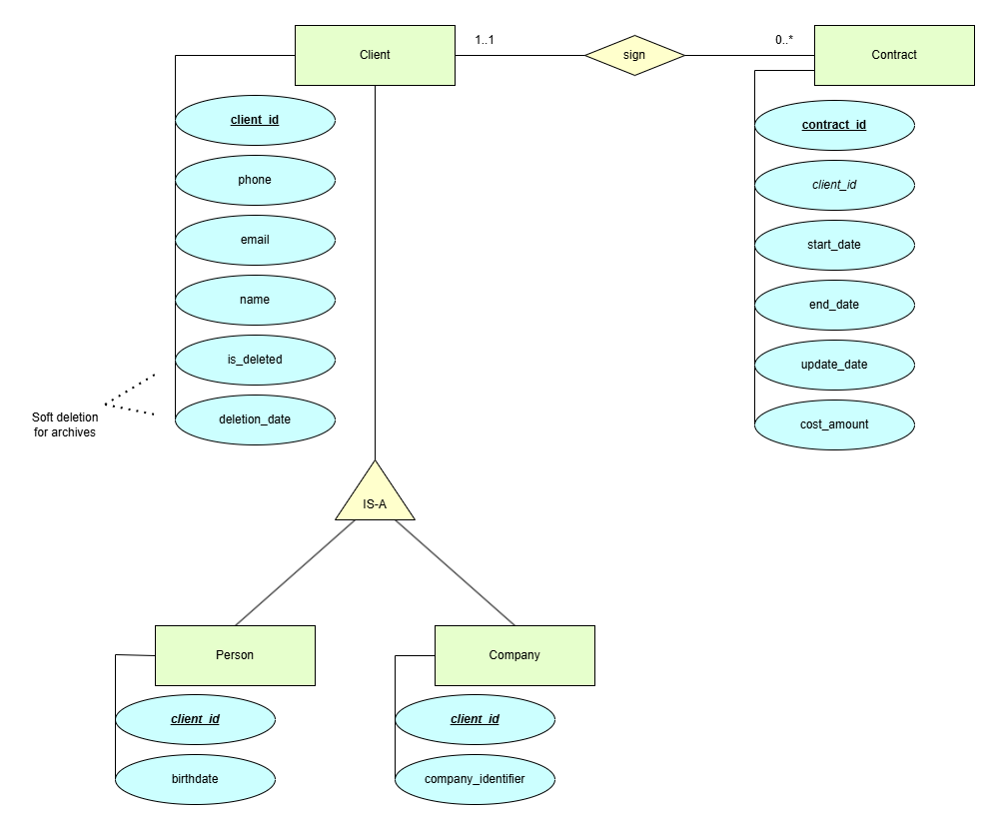

# Api Factory - Technical Exercise

## Introduction

First of all, I would like to thank Api Factory for giving me the opportunity to complete this technical exercise.  
For this attempt, I relied on the following tools and resources:

- My university courses, particularly those related to database design.
- Several of my personal projects, which helped with SQL, Dockerfiles, and application setup.
- Draw.io, used to quickly create an Entity–Relationship (ER) model for the database.
- Spring Initializr, official Spring documentation, and courses from Spring Academy.
- Medium and Baeldung articles, as I often find them insightful and high-quality.
- ChatGPT 5 to validate design decisions, provide code guidance, and translate content.
- VS Code, without using GitHub Copilot.

## Project structure

- The `database/` directory contains the ER diagram and the SQL initialization script.
- The `backend/insurance-api/` directory contains the Spring Boot application, built using Maven.
- The `docker-compose.yml` file at the root orchestrates all containers (PostgreSQL, pgAdmin, and the backend).

## Run the full stack

### Run

To make the application easy to run, I created three Docker containers:

- A PostgreSQL database with a persistent volume.
- A dedicated PostgreSQL instance for integration and JUnit tests.
- A pgAdmin container (optional, but useful for database inspection).
- A backend container running the Spring Boot application.

A `docker-compose.yml` file is provided to start the entire stack with a single command:

```bash
docker compose up -d --build
```

- backend will be available at <http://localhost:8080>  
- swagger docs at <http://localhost:8080/swagger-ui/index.html>
- pgAdmin at <http://localhost:8888>

### PGAdmin (Optional)

Use the credentials defined in the docker-compose.yml file:

- Email: `admin@insurance.com`
- Password: `admin`

After logging into pgAdmin -> "Add New Server"

- General tab: any name (e.g., InsuranceDB)
- Connection tab:
  - Host name/address: postgres (or postgres-test)
  - Port: 5432
  - Maintenance database: insurance_db (or insurance_test_db)
  - Username: postgres
  - Password: postgres

Once saved, open Servers → Databases → insurance_db → Schemas → public → Tables to view all tables.

### Stop

This command stops and removes the containers, but keeps the persistent data volume intact:

```bash
docker compose down
```

If you want to delete absolutely everything Docker-related  
(containers, images, networks, and volumes that are not currently used):

```bash
# WARNING This command will also delete non–project-related containers, images, and volumes.
docker compose down -v --rmi all
```

## Step 1: Database Design

The following diagram was created using draw.io:

<p></p>

- I chose to implement a generalization/specialization relationship between Client, Person, and Company.  
- The init.sql script provides an implementation of this schema.  
- The script is intentionally simple and does not include business logic,  
  such as automatically updating contract dates when a client is deleted.  
- That behavior is instead implemented in the backend application.

## Step 2: Docker setup

As mentioned above, Docker is used to containerize the full environment to ensure consistency and portability across machines.

## Step 3: Setup Git

A customized `.gitignore` was added at the project root to exclude  
IDE files, build artefacts, and confidential documents.  
For simplicity, environment variables are hardcoded in  
`docker-compose.yml` and `application.properties` instead of using a `.env` file.

## Step 4: Backend implementation

- Layered architecture:
  - Controller → Service → Repository → Model  
    (with Mapper bridging between Model and DTO)

Folder structure:

```
src
...
└───insurance_api
  ├───controller
  ├───dto
  ├───exception
  ├───mapper
  ├───model
  ├───repository
  ├───service
  ├───utils
  └───validation

tests:
...
└───insurance_api
    ├───controller
    ├───mapper
    ├───model
    ├───repository
    └───service
```

Endpoints

```
  GET     /api/v*/clients
  GET     /api/v*/clients?page=...&size=...&sortBy=...&sortDir=...
  GET     /api/v*/clients/{id}
  GET     /api/v*/clients/{id}/contracts/active
  GET     /api/v*/clients/{id}/contracts/costsum
  GET     /api/v*/clients/{id}/contracts/after?date=2025-01-01T00:00:00

  PATCH   /api/v*/clients/{id}
  DELETE  /api/v*/clients/{id}

  POST    /api/v*/clients/companies
  GET     /api/v*/clients/companies
  GET     /api/v*/clients/companies?page=...&size=...&sortBy=...&sortDir=...

  POST    /api/v*/clients/persons
  GET     /api/v*/clients/persons
  GET     /api/v*/clients/persons?page=...&size=...&sortBy=...&sortDir=...

  GET     /api/v*/contracts
  GET     /api/v*/contracts?page=0&size=5&sortBy=...&sortDir=...
  GET     /api/v*/contracts/{id}
  POST    /api/v*/contracts
  PATCH   /api/v*/contracts/{id}
  DELETE  /api/v*/contracts/{id}
```

Main design decisions:

- Created an abstract Client class.
- Used DTOs to hide internal model details.
- Implemented custom mappers instead of MapStruct for more control.
- Used JPA lifecycle annotations (@PrePersist, @PostPersist, @PreUpdate) to auto-update attributes.
- Added custom SQL queries for active-contract and performant cost-sum endpoints.
- Implemented attribute validation using Jakarta Validation (JSR-380).
- Enforced ISO 8601 date format using Java’s built-in LocalDate and LocalDateTime classes.
- Designed REST responses to include fully resolved relationships in JSON.

## Step 5: Validation and Tests

To validate the implementation,

1. start the containers

2. stop only the backend container (it uses the same port as tests):

```bash
docker compose up -d
docker stop insurance_api
```

3. Run all JUnit and integration tests

4. To see the complete list of tests, open: `./tests-list.md`
